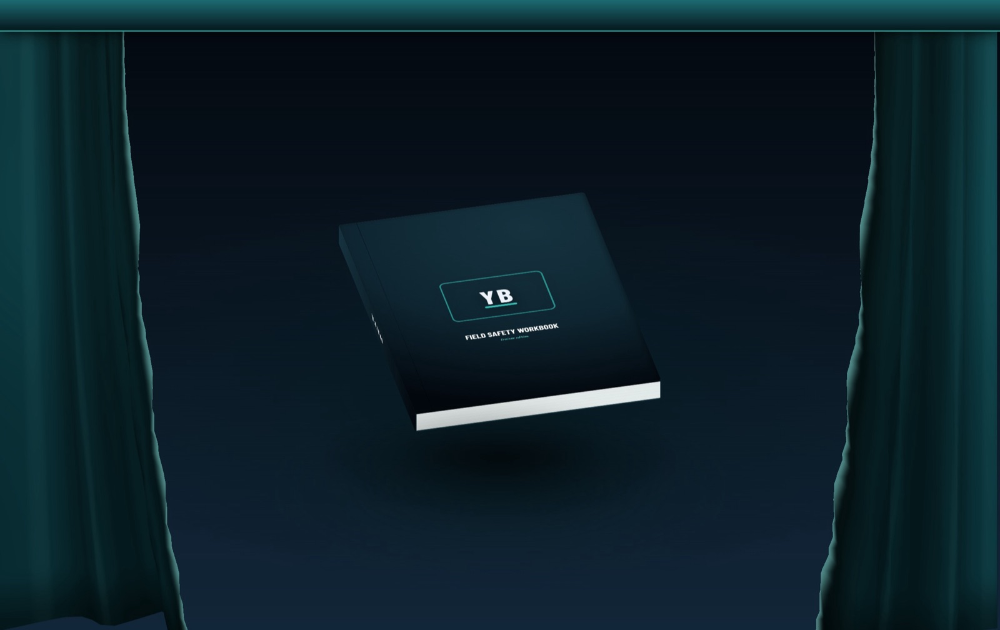
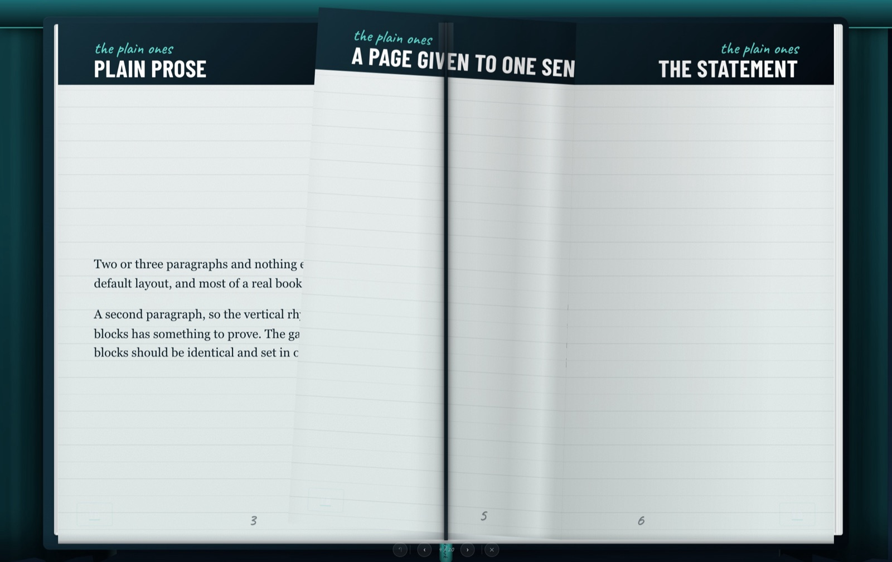
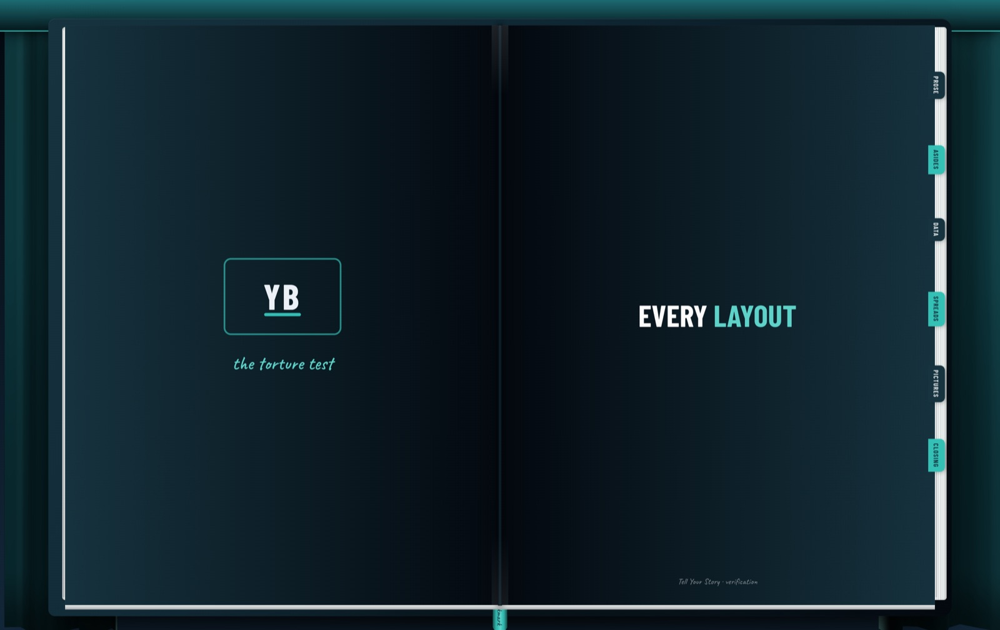
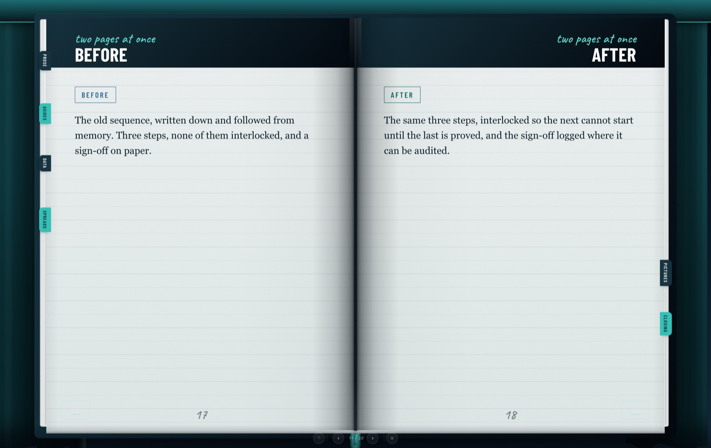
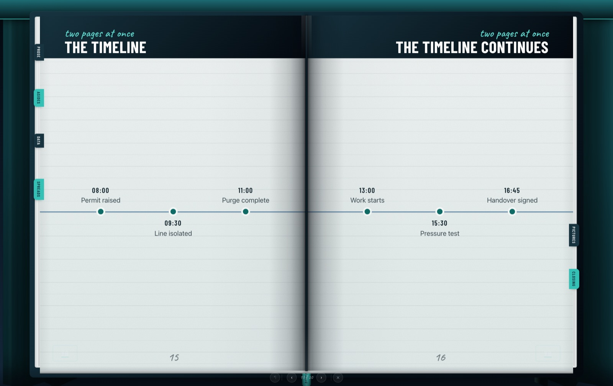
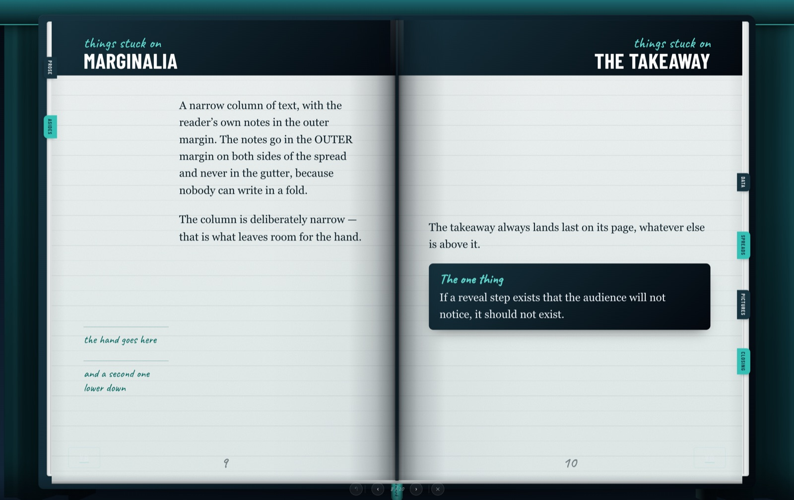
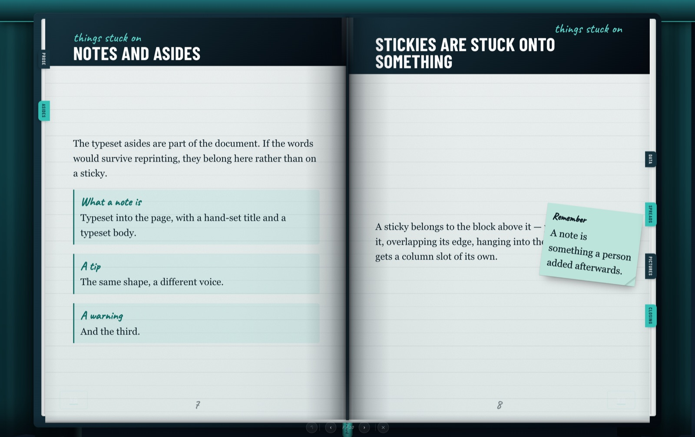
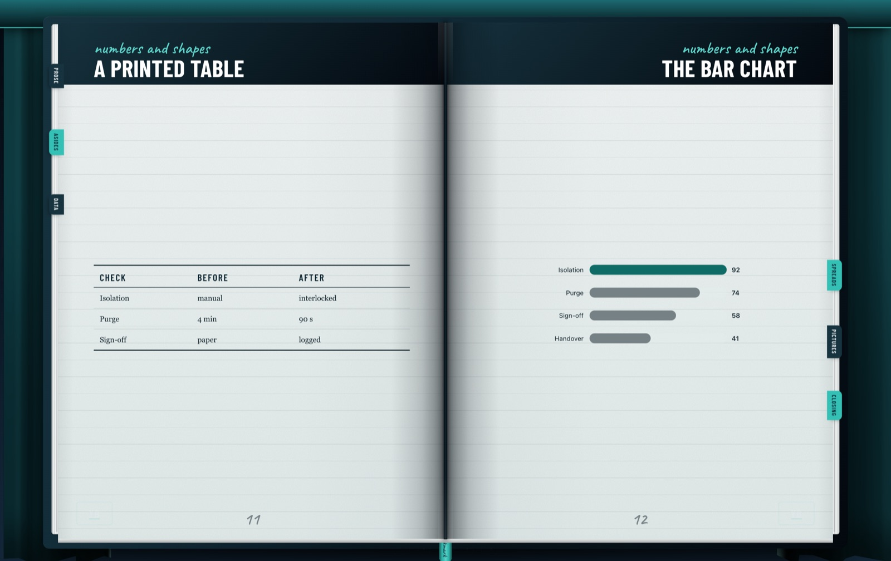
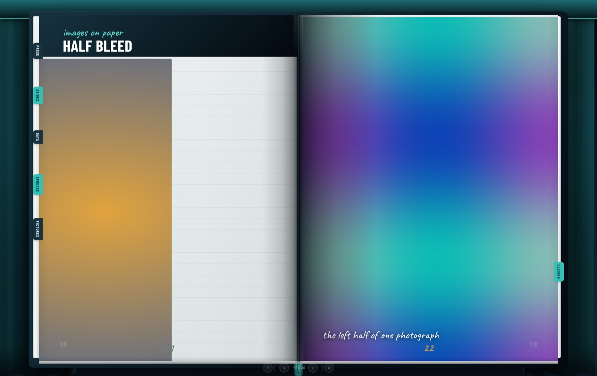

<div align="center">


**One Markdown file in. One standalone HTML flipbook out.**

A 3D workbook that opens on a stage curtain — hard section boards, fore-edge
tabs, sticky notes, page curvature, presenter-remote control. No server, no
network, no folder of assets. It opens from a USB stick.



*The real thing, not a mock-up — a WebGL curtain parting on the closed book.*

</div>

---

## What this is

A [Claude Code](https://claude.com/claude-code) skill. Point it at a Markdown
lesson and it produces **one HTML file** — fonts, pictures, animation engine and
all — that runs offline, anywhere, forever.

It is deliberately **brand-agnostic**. Every colour, typeface and proportion
comes out of `theme.json`. Ships neutral; rebrand in one file.

```bash
node scripts/prep.ts content/lesson.md                     # 1. shape it  ← do not skip
node dist/build.mjs  content/lesson.md output/book.html    # 2. build it
node dist/build.mjs  content/lesson.md output/book.html --watch   # or: rebuild on save
```

That's it. `output/book.html` is the deliverable — and **there is no install
step.** Node 22 or newer is the whole requirement. The builder ships with its
four dependencies compiled in and produces a byte-identical book to the
from-source path.

---

## Install

### As a Claude Code skill

Drop it where Claude Code looks for skills and it becomes available by name.

```bash
git clone https://github.com/bludiesel/tell-your-story.git ~/.claude/skills/tell-your-story
```

For one project only, clone into `<project>/.claude/skills/` instead — the skill
is then available in that repo and nowhere else.

Restart Claude Code, or start a new session, and ask for what you want:

> *"Build me a training flipbook on confined-space entry."*

The skill announces itself through the `description` in its `SKILL.md`, so it
triggers on **workbook, handbook, induction, briefing, training material,
interactive lesson** — you do not have to name it. If you want to be explicit,
`/tell-your-story` invokes it directly.

### Anywhere else

It is a plain Node project with the builder already compiled. Clone it and run
the scripts — no install. Nothing about it depends on Claude Code; the skill
wrapper is a convenience, not a requirement.

### First run — prove it works before you write anything

```bash
node dist/build.mjs content/sample-book.md output/sample.html
open output/sample.html
```

You should get a stage curtain that parts when you click it, a book that opens,
and pages that turn. **If that works, everything works** — the sample exercises
the curtain, the flip engine, the fonts and the reveals in one go.

Then check the machinery honestly reports itself:

```bash
npm install               # contributors only
node scripts/check.ts     # the full suite
npx tsc --noEmit          # types
```

Both should be silent-or-green on a fresh clone. If `check` complains that the
runtime bundle is stale, run `node scripts/prebundle.ts` — that only happens if
you have edited `src/runtime/`.

### What you need

| | |
|---|---|
| **Node 22 or newer** | The entire requirement. `node --version` |
| ~~npm~~ | **Not needed.** Only to change the skill itself |
| A browser | Only to *look* at a book. Building needs none |
| A phone | **Works.** On a narrow screen the book turns ONE page at a time instead of a spread, chosen by whichever renders larger — and the reader can override it either way from the ◫ control in the bottom bar, which is remembered |
| Fonts | **None to install.** Barlow Condensed and Caveat are subset and embedded in every book; both are Google Fonts under the SIL OFL if you ever want the full families |

No Bun, no Python, no Playwright, no build step.

---

## If you are a coding agent

Read this part; it is the difference between a good book and a wall of text with
a page-turn effect.

**Read these two files before authoring anything.** They are short and they are
the whole job:

| Read | Why |
|---|---|
| [`templates/CHOOSING.md`](templates/CHOOSING.md) | **Which layout for which content shape.** The decision most likely to go wrong. Work down the table; the first row that genuinely fits wins |
| [`templates/LAYOUTS.md`](templates/LAYOUTS.md) | Copyable syntax for every layout |
| [`docs/every-layout.html`](docs/every-layout.html) | **The catalogue, pre-built.** Open it — no build needed. |
| [`content/every-layout.md`](content/every-layout.md) | **The catalogue source.** Build it and LOOK: one page per layout, one block per feature. Reading syntax is not the same as seeing the page it makes |

**Then follow this order, and do not skip step 1.**

```bash
node scripts/prep.ts content/lesson.md   # 1. it tells you how to chunk
node dist/build.mjs  content/lesson.md output/book.html
node dist/motion.mjs output/book.html    # 3. what moves, and whether it obeys the rules
```

`prep` measures what cannot be judged by reading — page fill against real
capacity, headless pages, a facing pair that has been split across a spread,
which blocks should arrive in which order. It **reports; it never rewrites your
words.** Apply its advice, re-run it, and keep going until it says the book is
well chunked. It is the single highest-leverage thing in the repo.

**Five rules that will bite you:**

1. **Prose is the correct answer most of the time.** In a good book most pages
   are prose and the specific layouts are punctuation. A book where every page
   is a different layout reads as a demo of the tool.
2. **One layout per page.** They are never combined. A page with a table *and* a
   chart is two pages.
3. **`:::compare` and `:::timeline` need FACING pages.** A comparison whose other
   half is overleaf is half an argument. `prep` reports the spread each page
   lands on so you do not have to count.
4. **Never invent numbers.** If you do not know a pressure limit, an emergency
   number or a statistic, leave a `[BRACKETED BLANK]` for a human — the build
   refuses to ship the templates' own placeholders, but it keeps yours.
5. **A sticky note attaches to the block above it.** Write it directly after the
   thing it annotates.

**If the brief does not say what the training is about**, do not ship the starter
with its placeholders — the build will refuse it, and rightly. Write real content
on the subject you can infer, put a `:::warning` on the first page and a line in
the `:::colophon` saying it is a draft pending review by whoever owns the
material.

**A prompt that works**, if you want to hand this to an agent verbatim:

> Use the tell-your-story skill to build a training flipbook on **[SUBJECT]** for
> **[AUDIENCE]**, about **[N]** pages. Read `templates/CHOOSING.md` first and pick
> layouts from the content shape, not for variety. Run `prep` before building and
> apply what it says. Leave any figure you cannot verify as a bracketed blank.

---

## What it looks like

<table>
<tr>
<td width="50%"></td>
<td width="50%"></td>
</tr>
<tr>
<td><b>Real page turns.</b> Paper bends. Boards don't — a hardback cover turns rigid, because it is one.</td>
<td><b>Fore-edge tabs</b> per section, which step aside once read. Click one to jump.</td>
</tr>
<tr>
<td></td>
<td></td>
</tr>
<tr>
<td><b>Before / after</b> across facing pages. Same structure both sides, so the only difference is the content.</td>
<td><b>A timeline rail</b> that crosses the fold — one line over two sheets of paper.</td>
</tr>
<tr>
<td></td>
<td></td>
</tr>
<tr>
<td><b>Marginalia</b> in the outer margin, never the gutter — nobody can write in a fold.</td>
<td><b>Sticky notes</b> that attach to the block above them, the way a person actually adds one.</td>
</tr>
<tr>
<td></td>
<td></td>
</tr>
<tr>
<td><b>Charts and diagrams</b> are real SVG, drawn at build time, animated when their step arrives.</td>
<td><b>Full-bleed pictures</b> to every edge, with the caption printed over them.</td>
</tr>
</table>

---

## Seventeen layouts, and a guide for choosing between them

The failure mode of any kit like this is using three blocks and ignoring the
rest, so choosing is documented separately from syntax:

| File | What it answers |
|---|---|
| [`templates/CHOOSING.md`](templates/CHOOSING.md) | **Which layout for which content.** One table, by content shape — not by block name. Read this first. |
| [`templates/LAYOUTS.md`](templates/LAYOUTS.md) | Every layout, with copyable syntax and placeholder text to replace. |
| [`templates/starter.md`](templates/starter.md) | A real three-section book to copy. It builds as it stands. |

| Authored | Generated for you |
|---|---|
| `prose` · `opener` · `statement` · `quote-page` · `has-sticky` · `marginalia` · `takeaway` · `ptable` · `barchart` · `timeline` · `compare` · `half-bleed` · `full-bleed` · `colophon` | `cover` · `contents` · `divider` |

The generated three are derived, never written: the contents page takes its page
numbers from where the pages actually landed, so **it cannot cite a page that is
not there.**

---

## Why it is built the way it is

**The book states what it is.** Every page carries `data-layout`, `data-slot`,
`data-stock` and `data-screen-label`. Rules that live only in prose get violated
three edits later; rules in attributes can be checked.

**It measures the machine it lands on.** A book might be opened on a locked-down
site laptop, a decade-old meeting-room PC, or a phone. User agents lie and pixel
ratios say nothing about the GPU, so the book doesn't ask — it watches its own
frames for the first second and steps the whole page down a tier if they aren't
arriving on time. What it drops is scenery (blurs, the second floor shadow, the
cloth shader). What it keeps is paper, type, turns and reveals.

**Presenter steps are the pacing engine.** A page arrives one block at a time,
and `next` means *next block* until the spread is exhausted — so you can talk to
a point while it is the only thing on the page. It hangs off the same next/back
a clicker already sends.

**Placeholders cannot ship.** The build refuses to write a book still containing
a `[BRACKETED]` string from a template, names every one it found, and writes
nothing.

---

## Light on purpose

<div align="center">



</div>

A built book is one file. The tool that builds it is nearly as lean:

| | |
|---|---|
| Runtime | **Node only.** No Bun, no Python, no browser, no build step |
| Needed to build a book | **Nothing to install.** The 4 packages it uses — markdown-it, linkedom, yaml, svg.js — are compiled into the committed `dist/build.mjs` |
| Bundled into the book | page-flip, GSAP, curtains.js — already committed as one file, so they are not fetched at build time |
| Fonts | subset and embedded; a book needs no network |

Every number on that card is measured on this commit, not rounded up for the
graphic: `163` is what `node scripts/check.ts` prints, `17` is the length of
`LAYOUTS` in `src/layout.ts` with all seventeen proved reachable by
`scripts/verify.ts`, and `1` is the entire point of the project.

---

## Every script

| Command | What it does |
|---|---|
| `node scripts/prep.ts <file>` | **Run this first.** Measures page lengths against real capacity, finds headless pages, warns when a facing pair has been split, proposes the reveal order. Reports; never rewrites your words. `--json` for machine use. |
| `node dist/build.mjs <in> <out>` | Markdown → one standalone HTML book. **No install.** `src/build.ts` is the same thing from source, for contributors. |
| `node scripts/check.ts` | The full suite. Every check in it is a bug that once shipped looking fine. |
| `node dist/motion.mjs <book.html>` | **What moves on every page.** Prints turn behaviour and step count per page, and fails if a section board starts bending or swallowing presses. |
| `node scripts/verify.ts` | Copies each snippet out of `LAYOUTS.md`, builds it, and checks the page comes back as the layout the template promised. Writes [`VERIFICATION.md`](VERIFICATION.md). |
| `node scripts/drive-browser.mjs <url>` | Drives a built book in a real headless Chrome — curtain, turns, reveals, a held clicker, the tabs, the resume. The only thing that can see what a button press actually does. |

The last three exist because of one bug worth repeating: section boards were
never *animated* — that rule always held — but they still counted their number,
kicker and title as three reveal steps. So a presenter pressed next on a board
and **nothing happened three times** before the page turned. Invisible in the
HTML, obvious the moment you press a key twice.

---

## Rebranding

Everything visual is in [`theme.json`](theme.json) — palette, fonts, spacing
scale, motion durations. Seven ready-made palettes are in [`themes/`](themes/).

Contrast is enforced rather than hoped for: the build computes the real ratio of
body text against paper and of the cloth against its own folds, and tells you
which colour to move and by how much when a palette fails.

---

## Licence

[MIT](LICENSE) for this project's code.

Read [NOTICE](NOTICE) before redistributing books made with it: **GSAP and
page-flip are compiled into every book**, so they travel with anything you send.
page-flip is MIT; GSAP is free for most uses but is not an open-source licence.
The embedded fonts are SIL OFL 1.1.

[CREDITS.md](CREDITS.md) records the design lineage, including exactly what was
reimplemented from other projects and what was deliberately left behind.
